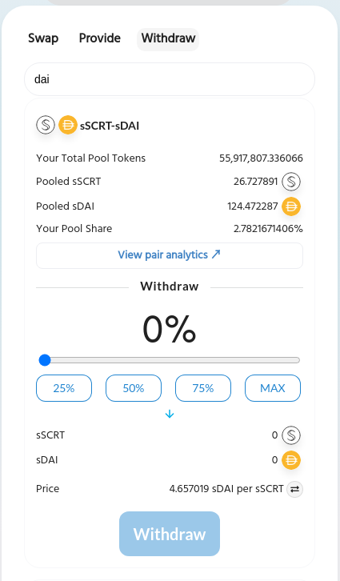

# Liquidity Pools

SecretSwap is an Automated Market Maker (AMM) built on the secret smart contracts powered by the Secret Network. This technology allows the community to swap tokens without an intermediary, by pooling tokens in SecretSwap as a liquidity provider.

The algorithm behind SecretSwap's liquidity pools is called the constant product formula, `y * x = k`. Liquidity Providers (LPs) lock their tokens in a pool at a certain ratio of `x` to `y` that determines the price the pool offers to the community.

To provide your SecretTokens to SecretSwap for liquidity, you use the "Provide" tab in the app. You can then pick the two tokens you wish to provide to SecretSwap as a LP. The app will show your available balance of each token, you can then enter the amount you wish to provide for one of your tokens and the app will calculate the amount of the other token that maintains the constant `k` of the pool. In cases where the liquidity pair does not exist, you get to set the ratio of the liquidity pool by the amounts of tokens you choose to provide.

The app will report the current price for the pool if the pair exists, and will also report the portion of the total tokens in the pool that you are providing. This is important information because your rewards depend on your share of the pool. You can always look at the current status of the liquidity pool by clicking the "View Pair Analytics" link in the app, which will take you to [SecretAnalytics](https://secretanalytics.xyz/) to look at the total amount of tokens in the pool, the pool's volume and rewards.

You will need to approve both tokens to be used by SecretSwap using the corresponding buttons and approving the transactions in Keplr. After clicking "Provide", your tokens will be added to the liquidity pool and you will receive Liquidity Provider tokens that represent your share of the pool. In order to see your LP token balance, you will need to navigate to the "Withdraw" tab on the app and choose the liquidity pool where you added your tokens. 

This tab will show the "View" icon if you don't have a viewing key for your LP tokens. You can click it to create a new viewing key and the app will display the balance of your LP tokens as well as the amount of pooled SecretTokens that you can redeem if you wish to withdraw your tokens from the pool. To withdraw, you can use the slider to select the amount and then approve the transaction in your Keplr wallet.

**Note:** The amounts of SecretTokens you can redeem for your LP tokens will change over time and will not necessarily be the same amount or ratio that you originally provided.

## Rewards

As an incentive to the community, SecretSwap has a 0.3% fee for every swap. This fee is added to the liquidity pool, giving LPs a share of these fees proportional to their share of the pool.

As a further incentive, certain trading pairs have staking rewards available. Liquidity Providers can stake their LP tokens and receive `SEFI` tokens, the Secret Finance governance token, as a reward. Currently, the pairs with staking rewards available are:

- sETH - sWBTC
- sSCRT - SEFI
- sSCRT - sETH
- sSCRT - sLINK
- sSCRT - sRSR
- sSCRT - sRUNE
- sSCRT - sUSDT
- sSCRT - sWBTC

## Impermanent Loss

This is an important concept for Liquidity Providers. By providing your tokens to the liquidity pool, you are allowing your tokens to be exchanged for one another. For example, you provide 30 `sDAI` and 10 `sSCRT` to the liquidity pool and own 100% of the pool. If the market price of `sSCRT` increases to 4 `sDAI`, arbitrageurs will buy `sSCRT` until the pool's price reflects the market price. This removes `sSCRT` and adds `sDAI` to the pool until the pooled tokens are 35 `sDAI` and 8.6 `sSCRT`.

If the LP had not provided the tokens to the pool, their original 10 `sSCRT` would now be worth \$40. With the pool exchanging some of the tokens, the 8.6 `sSCRT` is now worth around \$34. The difference of \$6 is the impermanent loss. It is referred to as impermanent because the pool tokens are in constant flow and the amounts will continue to change. Once the LP withdraws the tokens from the pool, this loss would become permanent. This risk is why incentives are provided to compensate Liquidity Providers.
